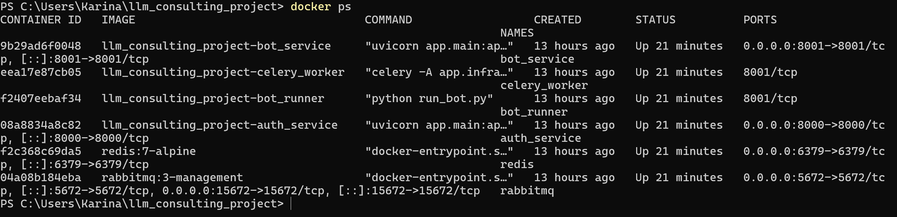
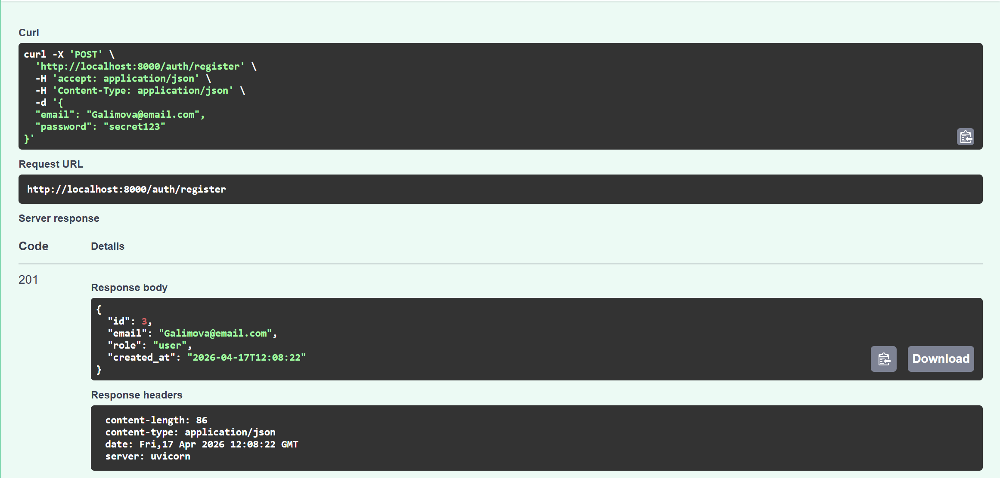
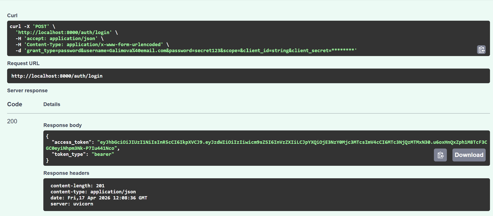
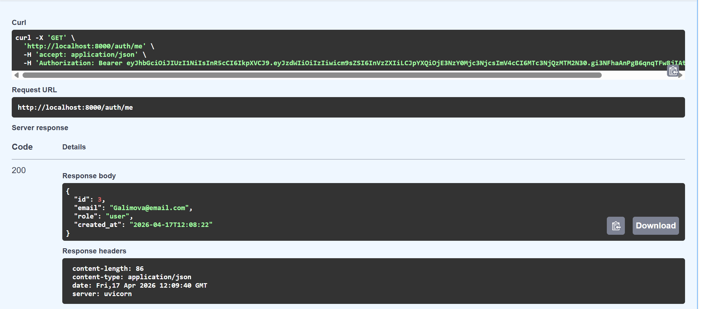
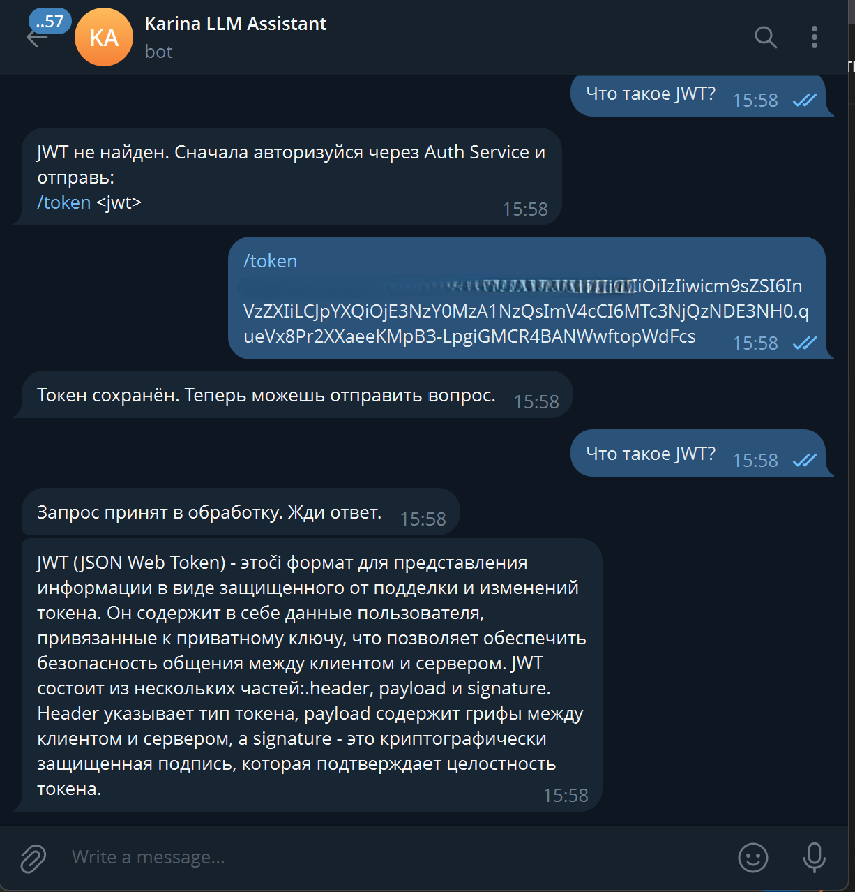
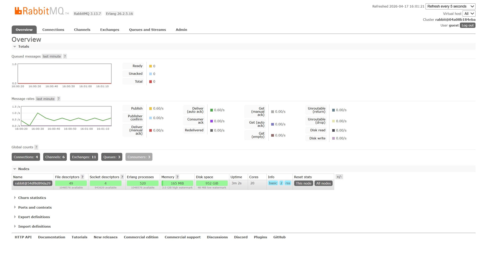
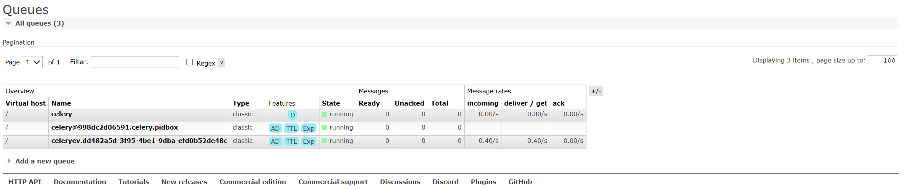
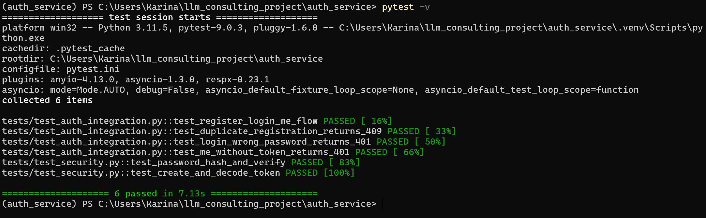
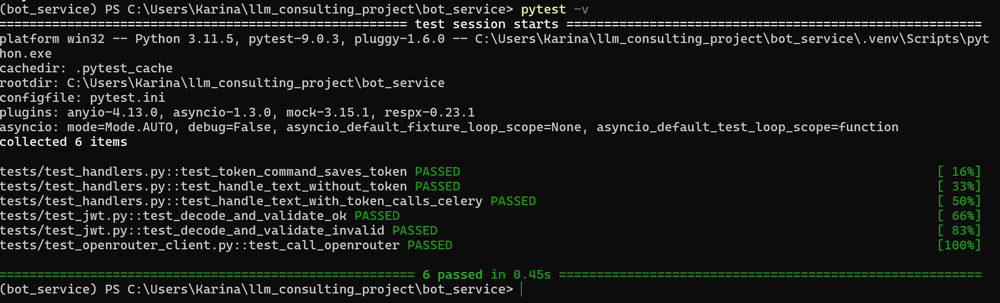

# LLM Consulting Project


##  Описание проекта


Проект реализует микросервисную архитектуру с Telegram-ботом и LLM:


- **Auth Service** — регистрация, логин, JWT

- **Bot Service** — Telegram-бот

- **Celery Worker** — асинхронная обработка задач

- **RabbitMQ** — брокер сообщений

- **Redis** — кэш / хранилище

- **OpenRouter** — генерация ответов через LLM


---


## Стек технологий


- Python 3.11

- FastAPI

- Docker + Docker Compose

- RabbitMQ

- Redis

- Celery

- OpenRouter API

- Pytest


---


## Запуск проекта


```bash

docker compose up --build
```


## После запуска


- Auth API: http://localhost:8000/docs  

- Bot API: http://localhost:8001/docs  


---


## Авторизация


Открыть Swagger:


http://localhost:8000/docs


Выполнить:


- POST /auth/register  

- POST /auth/login  


Получить `access_token`


---


##  Работа с Telegram-ботом


Отправить токен:


```

/token <JWT>

```


Задать вопрос:


```

Что такое FastAPI? (например)

```


Бот:

- принимает запрос  

- отправляет задачу в Celery  

- получает ответ от LLM  

- возвращает пользователю  


---


##  Тесты


### Auth Service


```

cd auth_service

pytest -v

```


### Bot Service


```

cd bot_service

pytest -v

```


## 📸 Скриншоты


### Docker контейнеры




---


### Swagger (Auth Service)


#### Регистрация




#### Логин




#### Проверка токена (/me)




---


### Telegram бот




---


### RabbitMQ


#### Overview




#### Queues




---


### Тесты


#### Auth Service




#### Bot Service



